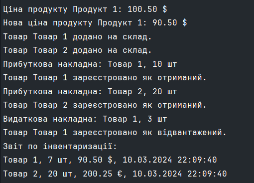

# LAB 1

## Code test result from [main method](./ConsoleApp/Program.cs#L8-L60) 

;

## Description of the code

### DRY (Don’t Repeat Yourself)
The code does not contain repeated blocks of code. 
Each piece of information has a single, immutable representation in the code.
We can see it in every class in [directory](./ClassLibrary)

### KISS (Keep It Simple, Stupid)
The code is simple and clear. 
It performs its tasks without unnecessary complexity.

### SOLID

* **Liskov Substitution Principle (LSP) :**
Classes [Dollar](./ClassLibrary/Dollar.cs) and [Euro](./ClassLibrary/Euro.cs) can be replaced by 
[ICurrency](./ClassLibrary/ICurrency.cs) without changing the correct execution of the program.
[Warehouse](./ClassLibrary/Warehouse.cs) can be replaced by any of its subtypes without changing the correct execution of the program

* **Interface Segregation Principle (ISP) :**
The [ICurrency](./ClassLibrary/ICurrency.cs) and [Warehouse](./ClassLibrary/Warehouse.cs) interface is specific and contains only the necessary methods.

* **Dependency Inversion Principle (DIP) :**
The [Money](./ClassLibrary/Money.cs) class depends on an abstraction ([ICurrency](./ClassLibrary/ICurrency.cs)) 
and not on concrete classes ([Dollar](./ClassLibrary/Dollar.cs), [Euro](./ClassLibrary/Euro.cs))
The [Reporting](./ClassLibrary/Reporting.cs) class depends on the abstraction ([Warehouse](./ClassLibrary/Warehouse.cs)), not on the concrete class (Warehouse).

### YAGNI (You Aren’t Gonna Need It)
The code does not contain anything superfluous and implements only the necessary functionality.

### Composition Over Inheritance
Composition is used ([Money](./ClassLibrary/Money.cs) has an [ICurrency](./ClassLibrary/ICurrency.cs) object;  [Reporting](./ClassLibrary/Reporting.cs) has a [Warehouse](./ClassLibrary/Warehouse.cs) object), not inheritance.

### Program to Interfaces, not Implementations
The [Money](./ClassLibrary/Money.cs) class is programmed to the [ICurrency](./ClassLibrary/ICurrency.cs) interface, not to specific implementations ([Dollar](./ClassLibrary/Dollar.cs), [Euro](./ClassLibrary/Euro.cs)).
And the [Reporting](./ClassLibrary/Reporting.cs) class is programmed to the [Warehouse](./ClassLibrary/Warehouse.cs) interface, not to a specific implementation [Warehouse](./ClassLibrary/Warehouse.cs).

### Fail Fast
If the input data for the [Money](./ClassLibrary/Money.cs) class or [Reporting](./ClassLibrary/Reporting.cs) class is not as expected, the program will immediately report an error.
